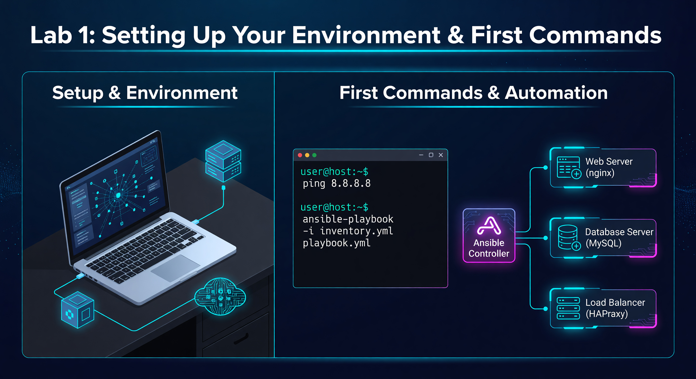
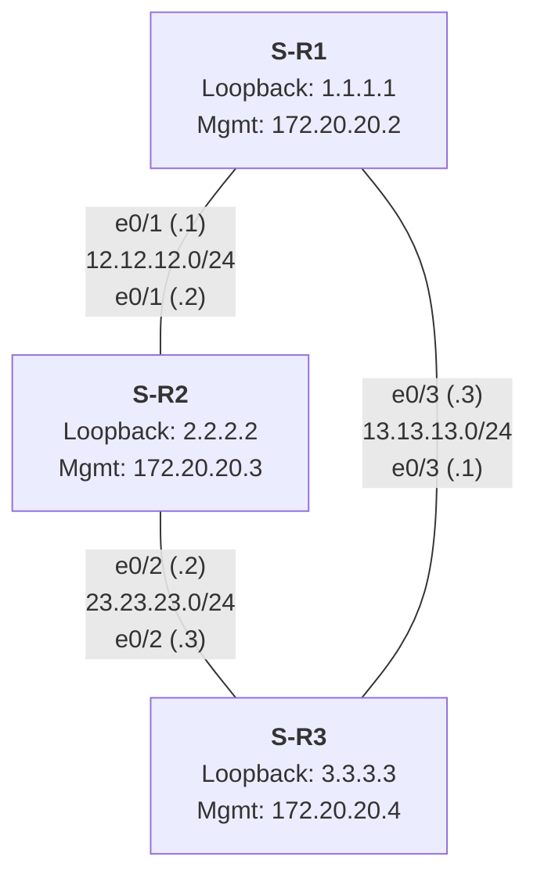

---

### 🛠️ How to Connect to a Router
If you need to verify your work or troubleshoot manually, follow these steps:
1.  **Requirement:** You must be logged into the Lab Server.
2.  **Connect via SSH (Replace X with your Pod Number):**
    *   **R1:** `ssh admin@172.20.20.2` (Adjust IP based on your specific Pod)
    *   **R2:** `ssh admin@172.20.20.3`
    *   **R3:** `ssh admin@172.20.20.4`
3.  **Password:** `800-ePlus`
4.  **Useful Verification Commands:**
    *   `show ip interface brief`
    *   `show version | include Software`

---

**🚀 Mission Prompt:** Establish First Contact. Your goal is to map your pod and prove you can control your network hardware from the Ubuntu command line using agentless automation.

---



# Lab 1: Setting Up Your Environment & First Commands

Welcome to your first lab! The goal of this exercise is to introduce you to the fundamental concepts of Ansible, establish a connection to your network devices, and run your first commands.

## 🧠 Core Concept: How Ansible Works
Ansible is an **agentless** automation tool. 
- **Control Node:** The Ubuntu machine you are logged into. It has Ansible installed.
- **Managed Nodes:** Your pod's three Cisco IOL routers. 
Ansible connects to these routers over **SSH**, executes a task, and then disconnects. It doesn't require any software to be installed on the routers themselves.

---

## 🗺️ Network Topology: Your Student Pod

Each student is assigned a "Pod" of three Cisco IOL routers connected in a triangle. 

### Visual Diagram (Mermaid)


### ASCII Reference
```text
                    +-----------------------+
                    |        S<student_id>-R1 |
                    |   Loopback: 1.1.1.1   |
                    |   Mgmt: 172.20.20.2   |
                    +-----------------------+
                    /e0/1 (.1)     \e0/3 (.1)
                   /                \
      12.12.12.0/24                  \ 13.13.13.0/24
                 /                    \
    e0/1 (.2)   /                      \  e0/3 (.3)
+-----------------------+          +-----------------------+
|        S<student_id>-R2 |          |        S<student_id>-R3 |
|   Loopback: 2.2.2.2   | e0/2 (.2)|   Loopback: 3.3.3.3   |
|   Mgmt: 172.20.20.3   +----------+   Mgmt: 172.20.20.4   |
+-----------------------+    ^     +-----------------------+
                             |
                       23.23.23.0/24
                         e0/2 (.3)
```

---

## Part 1: Create Your Ansible Inventory 🗂️

The **Inventory** is a file that tells Ansible *who* to talk to and *how* to authenticate. We use **YAML** format because it is human-readable and structured.

1. **Create a directory** called 'gem': `mkdir gem && cd gem`
2. **Create your inventory file**: `nano inventory.yml`
3. **Paste the following** (Replace `S1` with your pod number and verify IPs from the reference list provided in class):

```yaml
all:
  vars:
    ansible_user: admin
    ansible_password: 800-ePlus
    ansible_ssh_pass: 800-ePlus
    ansible_become_pass: 800-ePlus
    ansible_connection: ansible.netcommon.network_cli
    ansible_network_os: cisco.ios.ios
    ansible_become: yes
    ansible_become_method: enable
    ansible_ssh_extra_args: '-o StrictHostKeyChecking=no -o PreferredAuthentications=password -o PubkeyAuthentication=no'
    ansible_network_cli_ssh_type: paramiko

  children:
    routers:
      hosts:
        S<student_id>-R1: { ansible_host: 172.20.20.2 }
        S<student_id>-R2: { ansible_host: 172.20.20.3 }
        S<student_id>-R3: { ansible_host: 172.20.20.4 }
```

### 🔍 Breakdown of Inventory Variables:
*   **`ansible_network_os`**: Tells Ansible to use Cisco IOS logic.
*   **`network_cli`**: A specialized connection type for network devices that don't run Linux.
*   **`paramiko`**: The standard Python SSH library used to talk to Cisco devices.

**✅ Success Criteria:** You have a working `inventory.yml` file in your `gem` directory.

---

## Part 2: Ad-Hoc Commands 🛰️

An **Ad-Hoc command** is a one-liner used for quick tasks.

### 1. The Ping Test
```bash
ansible routers -i inventory.yml -m ping
```

**Educational Note:** This isn't an ICMP "network ping". This test checks if Ansible can:
1. Reach the IP.
2. Log in with the password.
3. Verify the environment is ready for commands.

**✅ Success Criteria:** You receive a "SUCCESS" message for all three routers in your pod.

---

## Part 3: Your First Playbook 📜

Create `lab01_facts.yml`:
```yaml
---
- name: Lab 1 - Display Specific Facts
  hosts: routers
  gather_facts: true
  tasks:
    - name: Display Hostname and Version
      debug:
        msg: "The hostname is {{ ansible_net_hostname }} and the version is {{ ansible_net_version }}"
```

### 🔍 Why use `gather_facts: true`?
When this is enabled, Ansible automatically logs into the router and runs a series of "show" commands to learn everything about the device (serial number, model, OS version). This data is stored in memory as **Facts**.

**Run the playbook:**
```bash
ansible-playbook -i inventory.yml lab01_facts.yml
```

**✅ Success Criteria:** The playbook finishes with `failed=0` and you see your router hostnames and versions in the output.

---

## 📂 Deep Dive: YAML Syntax Rules
YAML (YAML Ain't Markup Language) is the language of Ansible. It is sensitive to formatting, so follow these rules:

| Rule | Description | Example |
| :--- | :--- | :--- |
| **Indentation** | Use **spaces**, never tabs. Indentation levels indicate hierarchy. | `vars:` is indented under `all:` |
| **Colons** | Must be followed by a space when defining a value. | `key: value` (Correct) vs `key:value` (Wrong) |
| **Dashes** | Represent a list item. | `- name: Task Name` |
| **Booleans** | Case-insensitive values for true/false. | `yes`, `true`, `no`, `false` are all valid. |

---

## ❓ Knowledge Check
1.  **Agentless** means you don't need to install software on the router. (True/False)
2.  Which file tells Ansible the IP addresses of your devices?
3.  What is the purpose of the `debug` module?

---

## 📺 Video Tutorial: Watch & Learn
For a visual walkthrough of the concepts in this lab, check out this helpful tutorial:
[https://www.youtube.com/watch?v=346pNooH_N0](https://www.youtube.com/watch?v=346pNooH_N0)
