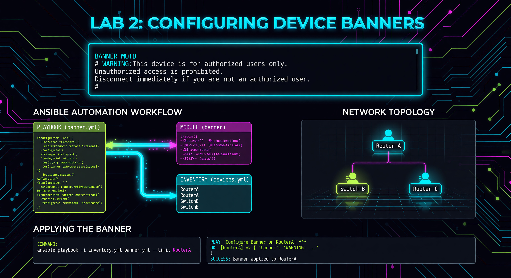

---

### 🛠️ How to Connect to a Router
If you need to verify your work or troubleshoot manually, follow these steps:
1.  **Requirement:** You must be logged into the Lab Server.
2.  **Connect via SSH (Replace X with your Pod Number):**
    *   
    *   
    *   
3.  **Password:** 
4.  **Useful Verification Commands:**
    *   
    *   

---


**🚀 Mission Prompt:** Brand the Network. Use the power of Idempotency to enforce a legal warning banner across all devices with zero manual CLI entry.

---




# Lab 2: Configuring Device Banners

In this lab, you will learn how to use specialized **Network Resource Modules** to change the configuration of your routers.

## 📖 What is Idempotency?
Idempotency is a foundational principle of modern automation and Infrastructure as Code (IaC). In the context of Ansible, it means that a task is designed to achieve a specific "end state" rather than just executing a command. When Ansible runs a module, it first checks the current state of the device. If the device already matches the desired configuration (e.g., the banner is already correct), Ansible reports "OK" and takes no action. If the device does not match, Ansible calculates the necessary commands to bring it into compliance and reports "Changed." This ensures that running the same playbook multiple times is always safe and predictable.

## 🎯 What is the Purpose?
The purpose of idempotency is safety and efficiency at scale. In traditional network management, running a configuration script twice might result in duplicate commands, errors, or unnecessary reboots. With idempotency, you can confidently run a playbook against 500 routers knowing that only the devices that *need* the change will be touched. This "declarative" approach reduces the risk of human error and ensures that your network stays in its intended state without creating "configuration drift."

---

## Task: Create the `lab02_banner.yml` Playbook

```yaml
---
- name: Configure MOTD Banner
  hosts: routers
  gather_facts: false
  tasks:
    - name: Set Message of the Day
      cisco.ios.ios_banner:
        banner: motd
        text: "Welcome to Student Pod Router - Authorized Access Only!"
        state: present
```

### 🔍 Breakdown of the Module:
*   **`state: present`**: This is **Declarative Programming**. 
    - **Imperative:** "Run the command `banner motd ...`"
    - **Declarative:** "I want the banner to be present."
    Ansible figures out the commands needed to make your wish a reality.

### 💡 Industry Pro-Tip: The Login Banner
In the real world, banners aren't just for welcome messages. They are legal requirements. Many organizations use them to warn unauthorized users that their activity is being monitored, which is often required to prosecute hackers.

Run the playbook:
```bash
ansible-playbook -i inventory.yml lab02_banner.yml
```

---

## 📂 Deep Dive: Check Mode & Diff Mode
Professional engineers often "dry-run" their changes before applying them to a live network.

| Feature | Flag | Purpose |
| :--- | :--- | :--- |
| **Check Mode** | `--check` | Tells Ansible to "pretend" to run the tasks. It shows what *would* change without actually touching the router. |
| **Diff Mode** | `--diff` | Shows you the "Before and After" text. You will see exactly what lines of config are being added or removed. |

**Try it!** Run `ansible-playbook -i inventory.yml lab02_banner.yml --check --diff` and see the detailed report.

---

## ❓ Knowledge Check
1.  If a playbook says `changed=0`, did it fail? (Yes/No)
2.  What is the difference between an "Imperative" command and a "Declarative" task?
3.  Why is "Idempotency" useful when updating 500 routers at once?


---

## 📺 Video Tutorial: Watch & Learn
For a visual walkthrough of the concepts in this lab, check out this helpful tutorial:
[https://www.youtube.com/watch?v=j9_t_p1p8-k](https://www.youtube.com/watch?v=j9_t_p1p8-k)
