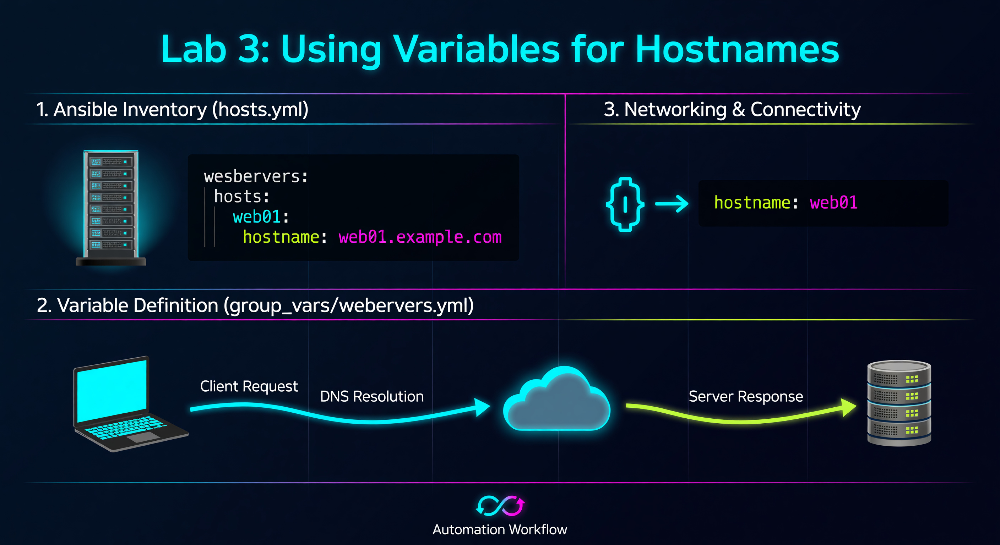

---

### 🛠️ How to Connect to a Router
If you need to verify your work or troubleshoot manually, follow these steps:
1.  **Requirement:** You must be logged into the Lab Server.
2.  **Connect via SSH (Replace X with your Pod Number):**
    *   **R1:** `ssh admin@172.20.20.2`
    *   **R2:** `ssh admin@172.20.20.3`
    *   **R3:** `ssh admin@172.20.20.4`
3.  **Password:** `800-ePlus`
4.  **Useful Verification Commands:**
    *   `show running-config | include hostname`
    *   `show ip interface brief`

---

**🚀 Mission Prompt:** The Dynamic Pod. Stop hard-coding! Use magic variables to make a single playbook that intelligently names every device in your inventory.

---



# Lab 3: Using Variables for Hostnames

This lab introduces **Dynamic Automation**. Instead of hard-coding names into a playbook, we use variables so the same playbook works for every device in your network.

## 📖 What is the DRY Principle?
DRY stands for **"Don't Repeat Yourself."** It is a core philosophy in software development and automation that aims to reduce the repetition of information. In network automation, if you have 10 routers, you shouldn't have 10 separate playbooks or 10 identical tasks with slightly different names. Instead, you define the "pattern" once (the playbook) and use variables to provide the unique data (the hostnames). This makes your code easier to read, faster to update, and significantly less prone to typos or synchronization errors.

## 🎯 What is the Purpose?
The purpose of DRY is **maintainability and scalability**. If you decide to change how your hostnames are formatted, a DRY-compliant system allows you to change it in one single place, and that change will propagate across all 10, 100, or 1,000 devices. By separating your "Logic" (how to set a hostname) from your "Data" (what the hostname is), you transform your automation from a collection of static scripts into a dynamic, enterprise-ready system.

---

## 📖 What are Magic Variables?
Magic variables are built-in pieces of data that Ansible automatically discovers or generates during the execution of a playbook. These variables are always available and do not need to be manually defined in your inventory or group files. The most common example is `inventory_hostname`, which always points to the name of the current host Ansible is talking to. Other magic variables can tell you about the groups a host belongs to (`group_names`) or provide access to data from other hosts in the inventory (`hostvars`).

## 🎯 What is the Purpose?
The purpose of magic variables is **context awareness**. They allow your playbooks to make intelligent decisions based on where they are running. For example, by using `inventory_hostname`, a single task can automatically apply a unique configuration to every router in your network without you having to hard-code a single name. Magic variables act as the "connective tissue" that allows your automation logic to interact dynamically with your inventory structure.

---

## Task: Create the `lab03_hostnames.yml` Playbook

```yaml
---
- name: Configure Device Hostnames
  hosts: routers
  gather_facts: false
  tasks:
    - name: Configure Hostname
      cisco.ios.ios_hostname:
        config:
          hostname: "{{ inventory_hostname }}"
        state: merged
```

### 🔍 Deep Dive: The Curly Braces `{{ ... }}`
In Ansible, whenever you see double curly braces, it means **"Variable substitution happens here."**
Ansible looks up the value of `inventory_hostname` and replaces the braces with the actual name (like `S<student_id>-R1`) before sending the command to the router.

### 💡 Industry Pro-Tip: Naming Conventions
Standardizing hostnames is the first step in network management. A good hostname often includes the site code, device type, and rack number (e.g., `NY-CORE-SW01`). Automation ensures these names are applied perfectly every time.

**Run the playbook:**
```bash
ansible-playbook -i inventory.yml lab03_hostnames.yml
```

**✅ Success Criteria:** Your routers now have hostnames that match their inventory names (e.g., R1's prompt changes from `Router#` to `S1-R1#`).

---

## 📂 Deep Dive: Variable Filters
You can transform variables on the fly using **Filters** (pipes).

| Filter | Usage | Result Example |
| :--- | :--- | :--- |
| **`upper`** | `{{ inventory_hostname | upper }}` | `s1-r1` becomes `S1-R1` |
| **`lower`** | `{{ inventory_hostname | lower }}` | `S1-R1` becomes `s1-r1` |
| **`default`** | `{{ my_var | default('Router') }}` | Uses 'Router' if the variable is missing. |

Filters allow you to enforce naming standards (like "all hostnames must be lowercase") even if the inventory has typos.

---

## ❓ Knowledge Check
1.  What does the "DRY" principle stand for?
2.  What would happen if you forgot the `{{ }}` around a variable name in a playbook?
3.  Where does the value for `inventory_hostname` come from?

---

## 📺 Video Tutorial: Watch & Learn
For a visual walkthrough of the concepts in this lab, check out this helpful tutorial:
[https://www.youtube.com/watch?v=RIsV6oD-Iio](https://www.youtube.com/watch?v=RIsV6oD-Iio)
