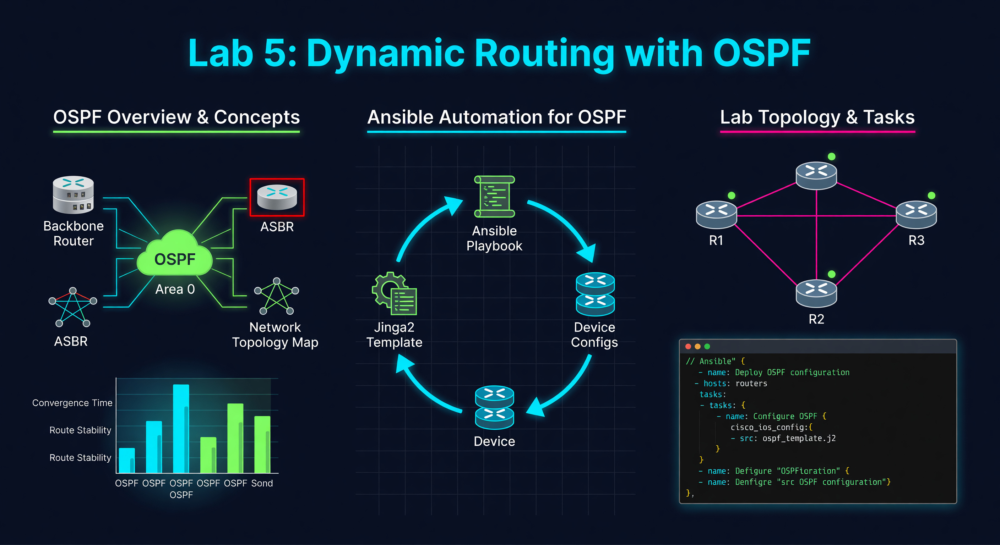

---

### 🛠️ How to Connect to a Router
If you need to verify your work or troubleshoot manually, follow these steps:
1.  **Requirement:** You must be logged into the Lab Server.
2.  **Connect via SSH (Replace X with your Pod Number):**
    *   
    *   
    *   
3.  **Password:** 
4.  **Useful Verification Commands:**
    *   
    *   

---


**🚀 Mission Prompt:** Automate the Intelligence. Use Jinja2 blueprints to deploy a self-healing OSPF mesh across your entire pod in seconds.

---




# Lab 5: Dynamic Routing with OSPF

Now that your interfaces have IPs, it's time to enable routing so the devices can talk to each other across the network.

## 📖 What is Jinja2 Templating?
Jinja2 is a powerful Python-based templating engine that allows you to create dynamic configuration files. Instead of writing out every single line of a Cisco configuration, you create a "blueprint" (a `.j2` file) that contains logic like loops and conditionals. When Ansible runs, it combines this blueprint with your inventory variables to "render" a final, device-specific configuration file. This is the industry standard for deploying complex protocols like BGP, OSPF, or VXLAN.

## 🎯 What is the Purpose?
The purpose is **flexibility and velocity**. Standard Ansible modules are great for simple tasks, but they can be limited when dealing with highly customized or vendor-specific configurations. Jinja2 allows you to generate thousands of lines of code in seconds, ensuring that every device is configured with perfect syntax. It also allows you to embed business logic—like "only enable OSPF on these specific interfaces"—directly into your configuration process.

---

## 📖 What is Dynamic Routing Automation?
Dynamic Routing Automation is the process of using code to deploy and manage protocols like OSPF or BGP. In a manual environment, an engineer would have to log into every router to define neighbor relationships and network advertisements. With automation, you define the routing policy once in a template, and Ansible ensures that the entire "mesh" is built consistently across your network.

## 🎯 What is the Purpose?
The purpose is **resilience and self-healing**. In a modern network, we want the infrastructure to be "intelligent." If a fiber optic cable is cut, dynamic protocols like OSPF automatically find a new path for traffic. By automating the deployment of these protocols, you eliminate the risk of a "routing loop" caused by a human typo and ensure that your network can recover from hardware failures without manual intervention.

---

## Task 1: Create the Jinja2 Template 📄

Create a folder named `templates`: `mkdir templates`
Create `templates/ospf_config.j2`:
```text
router ospf 1
 router-id {{ ospf.router_id }}
 log-adjacency-changes

 network {{ net.network }} {{ net.wildcard }} area {{ net.area }}


 
 interface {{ intf.name }}
  ip ospf 1 area 0
 

```

### 🔍 Deep Dive: Jinja2 Logic
*   **Loops (``)**: Allows you to repeat a command for every item in a list (like OSPF networks).
*   **Conditionals (``)**: Allows you to skip certain items. Here, we skip `Ethernet0/0` because we don't want to run OSPF on our management network.

---

## Task 2: Create the `lab05_ospf.yml` Playbook

```yaml
---
- name: Lab 5 - OSPF Configuration
  hosts: routers
  gather_facts: false
  tasks:
    - name: Generate and Apply OSPF Config
      cisco.ios.ios_config:
        src: templates/ospf_config.j2
```

### 🔍 Why use `src`?
When you use `src:`, Ansible performs the "Rendering" on your Ubuntu machine, and then pushes the resulting text to the router. This is much faster than running 20 individual commands one-by-one.

### 💡 Industry Pro-Tip: Dynamic Routing vs Static
In a large network, we never use static routes if we can avoid it. Dynamic protocols like OSPF allow the network to "self-heal." If a link breaks, OSPF automatically finds a new path. By automating OSPF, you ensure your network is resilient from day one.

Run the playbook:
```bash
ansible-playbook -i inventory.yml lab05_ospf.yml
```

---

## 📂 Deep Dive: Whitespace Control
Jinja2 can sometimes leave accidental blank lines in your configuration, which can cause errors on a Cisco router.

Professional developers use the **hyphen (`-`)** inside tags to control this:
- **``**: Removes whitespace *after* the block.

**Example:**
`` will generate a clean list without any extra carriage returns.

---

## ❓ Knowledge Check
1.  What is the file extension for a Jinja2 template?
2.  Why did we exclude `Ethernet0/0` from the OSPF configuration?
3.  What is the difference between a variable (`{{ }}`) and a loop (``) in Jinja2?


---

## 📺 Video Tutorial: Watch & Learn
For a visual walkthrough of the concepts in this lab, check out this helpful tutorial:
[https://www.youtube.com/watch?v=j9tVfEIsYms](https://www.youtube.com/watch?v=j9tVfEIsYms)
