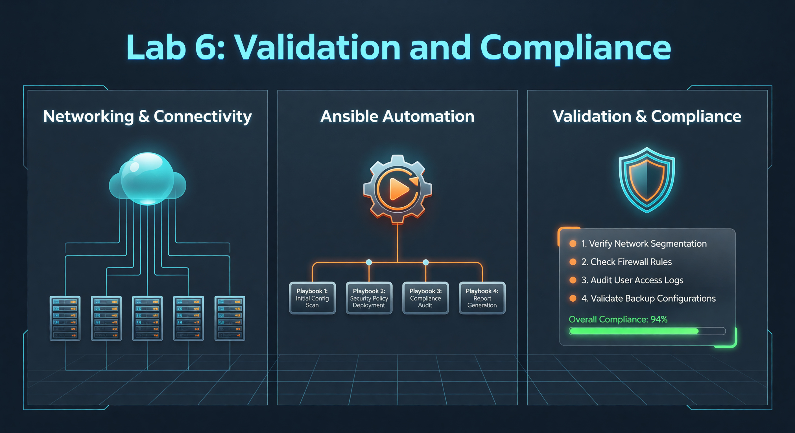

---

### 🛠️ How to Connect to a Router
If you need to verify your work or troubleshoot manually, follow these steps:
1.  **Requirement:** You must be logged into the Lab Server.
2.  **Connect via SSH (Replace X with your Pod Number):**
    *   **R1:** `ssh admin@172.20.20.2`
    *   **R2:** `ssh admin@172.20.20.3`
    *   **R3:** `ssh admin@172.20.20.4`
3.  **Password:** `800-ePlus`
4.  **Useful Verification Commands:**
    *   `show ip ospf neighbor`
    *   `show ip interface brief`

---

**🚀 Mission Prompt:** The Auditor. Don’t just push configuration; prove it works. Build a validation script that can detect and report a total network blackout.

---



# Lab 6: Validation and Compliance

Automation isn't just about *configuring* devices; it's also about *verifying* that the network is actually healthy. This is the foundation of **Intent-Based Networking (IBN)**.

## 📖 What is Operational State?
Operational State is the "real-time truth" of a networking device. While **Configuration** represents the intent (what you want the device to do), the **Operational State** represents the actual performance and connectivity (what the device is actually doing). For example, you might configure an interface with an IP address, but the operational state tells you if the cable is plugged in, if the light is green, and if traffic is actually flowing.

## 🎯 What is the Purpose?
The purpose is **Intent-Based Validation**. Automation that only pushes configuration is incomplete and potentially dangerous. By verifying the operational state (such as checking OSPF neighbor tables or BGP peering status), you confirm that your configuration achieved its intended goal. This closing of the loop—configuring, then verifying—is what transforms simple scripts into a robust, "self-aware" automation framework that can detect failures before they affect users.

---

## 📖 What is an Assertion?
An Assertion is a logical test within an Ansible playbook that evaluates a specific condition to see if it is true or false. It acts as an automated "Pass/Fail" gate. If the condition is met (e.g., "OSPF neighbor count > 0"), the playbook continues. If the condition fails, the playbook immediately stops and raises a critical alert.

## 🎯 What is the Purpose?
The purpose of assertions is **Automated Quality Assurance**. In a manual network change, an engineer might forget to verify the routing table after a change. Assertions force this verification to happen every single time, without exception. They provide immediate feedback during a rollout, allowing you to stop a deployment instantly if a single device fails its health check, thereby preventing a minor issue from becoming a network-wide outage.

---

## Task: Create the `lab06_validation.yml` Playbook

```yaml
---
- name: Lab 6 - Network Health Validation
  hosts: routers
  gather_facts: false
  tasks:
    - name: Check OSPF Neighbors
      cisco.ios.ios_command:
        commands: "show ip ospf neighbor"
      register: ospf_neighbors

    - name: Display Raw Output for Learning
      debug:
        var: ospf_neighbors.stdout[0]

    - name: Assert OSPF has Neighbors
      assert:
        that:
          - "ospf_neighbors.stdout[0] | regex_search('[0-9]+\\\\.[0-9]+\\\\.[0-9]+\\\\.[0-9]+')"
        fail_msg: "CRITICAL FAILURE: No OSPF neighbors found! Routing is NOT converged."
        success_msg: "SUCCESS: OSPF neighbors verified. The network is alive!"
```

### 🔍 Detailed Logic Breakdown:

1.  **`register: ospf_neighbors`**: This captures the output of the "show" command and saves it in a temporary variable.
2.  **`regex_search`**: This is a **Regular Expression**. We are scanning the text for any string that looks like an IP address (a Neighbor ID). 
3.  **`assert`**: This is your "Automated Auditor." If the test fails, the playbook stops immediately and alerts you.

**Run the playbook:**
```bash
ansible-playbook -i inventory.yml lab06_validation.yml
```

**✅ Success Criteria:** The playbook finishes with "SUCCESS" message if your OSPF is converged.

---

## Part 2: The Isolation Test (Definitive Failure) 🔴

To prove this works, you must see it fail. 

### Task: Manually break the network
Log into your **S<student_id>-R1** router via SSH and shut down all peered interfaces:
```bash
conf t
interface Ethernet0/1
  shutdown
interface Ethernet0/2
  shutdown
interface Ethernet0/3
  shutdown
end
```

Wait 30 seconds for OSPF to time out, then run:
```bash
ansible-playbook -i inventory.yml lab06_validation.yml
```

### 🔍 Analyzing the Failure
You should see a **RED** error message. This is exactly what a network engineer wants to see—a clear, automated alert that a specific device is isolated.

### 💡 Industry Pro-Tip: Automated Remediation
In advanced environments, if this validation fails, the system can automatically run **Lab 4** to fix the interfaces without a human ever getting involved!

**✅ Success Criteria:** You have successfully triggered a failure alert, proving your validation script works.

---

## 📂 Deep Dive: Regular Expressions (Regex)
Regex is a language for searching text. In this lab, we used:
`[0-9]+\.[0-9]+\.[0-9]+\.[0-9]+`

- **`[0-9]`**: Matches any number between 0 and 9.
- **`+`**: Matches "one or more" of the previous item.
- **`\.`**: Matches a literal period (we use the backslash because a normal period matches *anything* in Regex).

**Pro-Tip:** You can test your Regex patterns at [regex101.com](https://regex101.com). It is the #1 tool for network automation engineers!

---

## ❓ Knowledge Check
1.  What does the `register` keyword do?
2.  What is a Regular Expression (Regex) used for in this lab?
3.  Why is it important to verify the "Operational State" after making a change?

---

## 📺 Video Tutorial: Watch & Learn
For a visual walkthrough of the concepts in this lab, check out this helpful tutorial:
[https://www.youtube.com/watch?v=8mG5W_Q-V6k](https://www.youtube.com/watch?v=8mG5W_Q-V6k)
