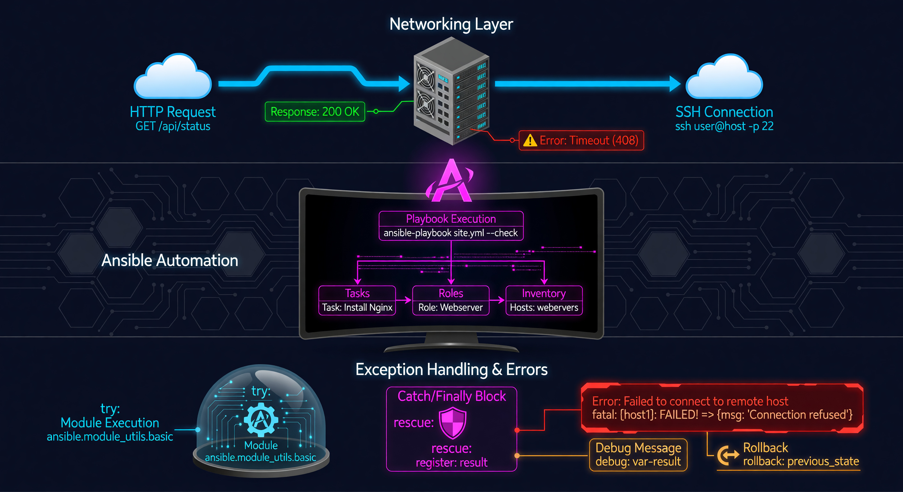

**🚀 Mission Prompt:** Bulletproof Automation. Make your scripts indestructible. Build logic that catches errors and fails gracefully when the network fights back.

---




# Lab 9: Exception Handling

In the real world, things go wrong. A router might be offline, a command might be misspelled, or a network link might fail. **Exception Handling** allows your playbook to "fail gracefully" instead of just crashing.

## 🧠 Core Concept: Resilience
Professional automation must be resilient. It should be able to detect an error, try to fix it, or at least log the problem and move on to the next task without stopping the entire project.

---

## 🧠 Core Concept: Block, Rescue, Always
- **`block`**: The tasks you *want* to run.
- **`rescue`**: Tasks that run *only if* something in the block fails. (Like "Error Handling").
- **`always`**: Tasks that run no matter what happens (success or failure).

---

## Task: Create the `lab09_exceptions.yml` Playbook

```yaml
---
- name: Lab 9 - Resilience Test
  hosts: routers
  gather_facts: false
  tasks:
    - block:
        - name: Attempt to run an invalid command (This will fail)
          cisco.ios.ios_command:
            commands: "show flux-capacitor status"
            
      rescue:
        - name: Handle the error
          debug:
            msg: "RESCUE: The command failed, but I caught the error. Logging it now..."

      always:
        - name: Final Cleanup
          debug:
            msg: "ALWAYS: This message appears no matter what. Closing connections..."
```

### 🔍 Detailed Breakdown:
*   **The Failure:** Since `show flux-capacitor` is not a real Cisco command, the router will return an error.
*   **The Rescue:** Normally, this error would stop the playbook. But because it is inside a `block`, Ansible jumps to the `rescue` section instead.
*   **The Always:** This is perfect for "Cleanup" tasks, like deleting temporary files or sending a final "I am finished" email.

### 💡 Industry Pro-Tip: Troubleshooting
When a playbook fails, the first thing an engineer does is look at the **"Play Recap."** 
- **Failed:** Something broke and wasn't caught.
- **Rescued:** Something broke, but the playbook handled it.
Always aim for `rescued` over `failed` for known edge cases!

Run the playbook:
```bash
ansible-playbook -i inventory.yml lab09_exceptions.yml
```

---

## 📂 Deep Dive: `ignore_errors` vs `rescue`
You might see some playbooks use `ignore_errors: yes`.

| Feature | Behavior | Use Case |
| :--- | :--- | :--- |
| **`ignore_errors`** | Keeps going no matter what. The failure is ignored and forgotten. | Quick tests or non-critical cleanup. |
| **`block/rescue`** | Stops the current task but runs a **specific alternative task** to handle the problem. | **Production standard.** Use this when you need to log an error, send an alert, or try a "Plan B." |

---

## ❓ Knowledge Check
1.  Which section runs only when a task fails?
2.  Which section runs every single time, even if there is an error?
3.  Why is exception handling important for a network with 1,000 devices?


---

## 📺 Video Tutorial: Watch & Learn
For a visual walkthrough of the concepts in this lab, check out this helpful tutorial:
[https://www.youtube.com/watch?v=rWl-f8y4V6I](https://www.youtube.com/watch?v=rWl-f8y4V6I)
