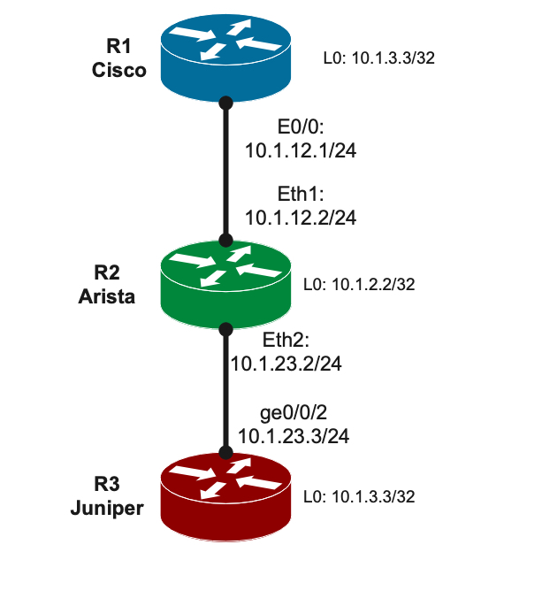
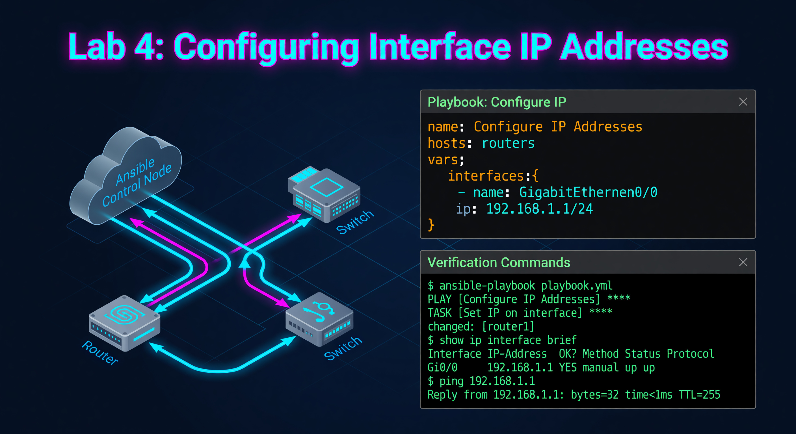
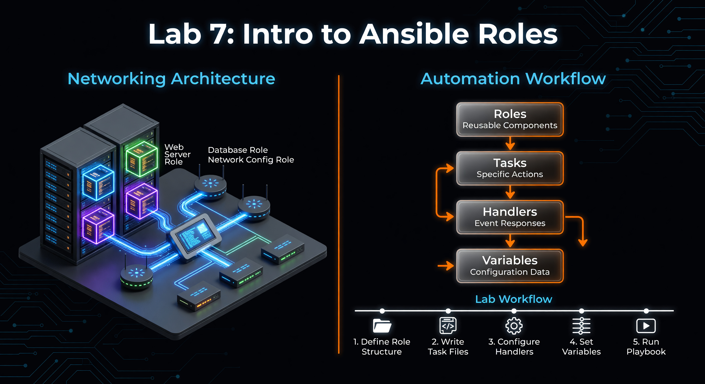
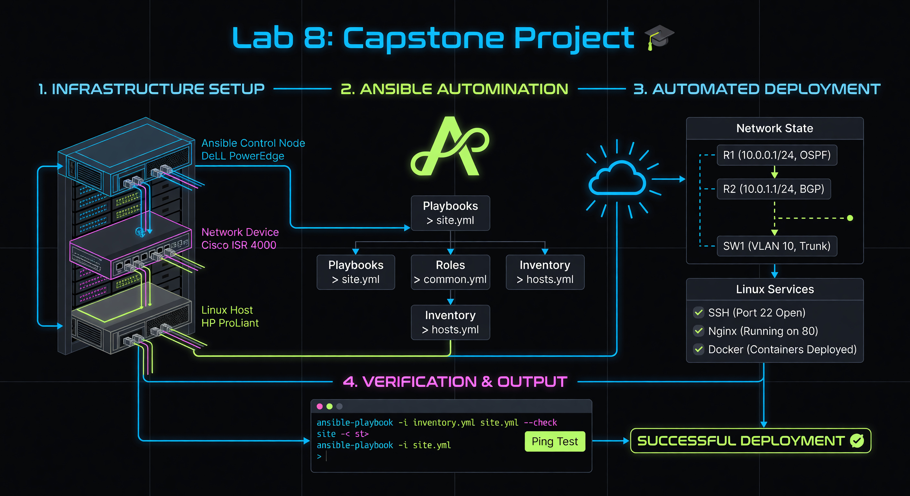

# DLR Cisco Automation Lab Guide

## Lab Overview
| Lab | Topic | Preview |
| :--- | :--- | :--- |
| **01** | First Commands |  |
| **02** | Configure Banner |  |
| **03** | Variables |  |
| **04** | Interfaces |  |
| **05** | Routing |  |
| **06** | Validation |  |
| **07** | Roles |  |
| **08** | Capstone |  |
| **09** | Exceptions |  |

---

This lab environment provides a hands-on journey through automating Cisco IOS devices using Ansible. Below are the core concepts covered in this curriculum:

## 1. Network Fact Gathering (Lab 01)
The foundation of automation is visibility. Using `ansible.netcommon.network_resource`, Ansible connects to the router and translates the unstructured "show" commands into structured JSON data. This allows you to programmatically verify versions, serial numbers, and interface states.

## 2. Declarative Configuration (Lab 02-03)
Instead of typing commands like a script, we define the "Desired State." 
- **Idempotency**: Ansible checks if a banner or hostname is already correct. If it is, it does nothing. This prevents unnecessary configuration changes and reloads.
- **Variables**: By using `inventory.yml` and `host_vars`, we decouple the *logic* (the playbook) from the *data* (the IP addresses and names).

## 3. Resource Modules: L3 Interfaces & OSPF (Lab 04-05)
Modern Ansible uses "Resource Modules" (like `cisco.ios.ios_l3_interfaces`).
- **Abstraction**: You don't need to know the specific Cisco CLI syntax for every version. You simply define the IP and mask in YAML, and the module handles the translation.
- **Dynamic Routing**: Lab 05 focuses on OSPF automation, where we manage the OSPF process, area assignments, and network advertisements at scale.

## 4. Validation & State Checking (Lab 06)
Automation isn't just about pushing config; it's about verifying it worked. We use `assert` and `wait_for` tasks to ensure that after a configuration change, the routing table is populated and neighbors are up.

## 5. Architectural Scaling: Roles (Lab 07-08)
As labs grow complex, single YAML files become unmanageable.
- **Roles**: We break automation into small, reusable components (e.g., a "common" role for DNS/NTP, an "ospf" role for routing).
- **Capstone**: This integrates all previous concepts into a single "push-button" deployment that can bring up an entire multi-router network from scratch.

## 6. Exception Handling (Lab 09)
In real-world networks, things fail. We use `block`, `rescue`, and `always` to handle connection timeouts or invalid configurations gracefully, ensuring the automation platform stays stable even when the network is not.

---
*Generated for the MUFG Automation Lab.*
